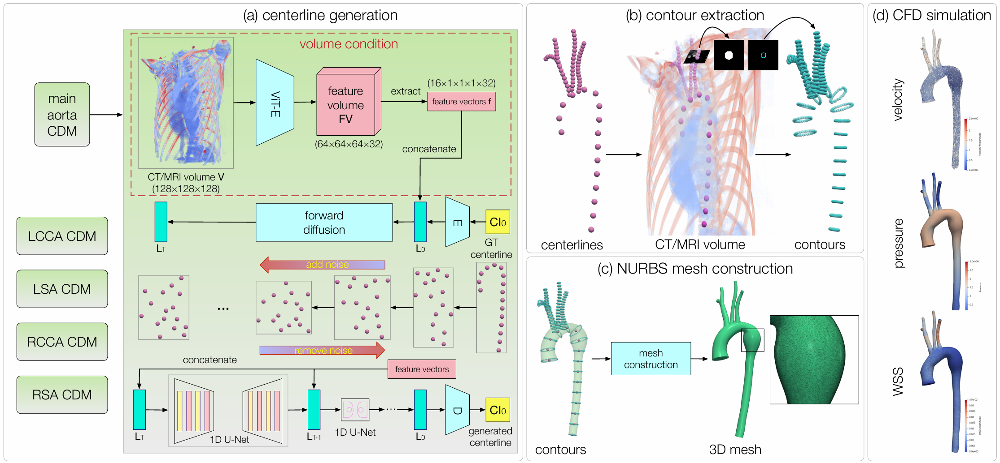
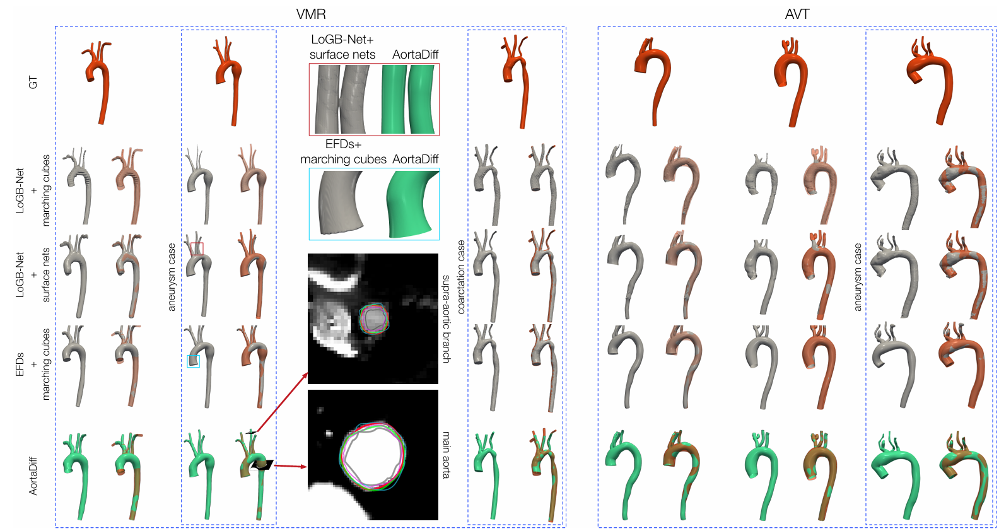

# AortaDiff: Volume-Guided Conditional Diffusion Models for Multi-Branch Aortic Surface Generation

> Official implementation of **AortaDiff: Volume-Guided Conditional Diffusion Models for Multi-Branch Aortic Surface Generation**
> **Authors:** Delin An, Pan Du, Jian-Xun Wang, Chaoli Wang  
> Published in **IEEE Transactions on Visualization and Computer Graphics (IEEE TVCG), 2026**

---

## 📌 Overview

AortaDiff is a volume-guided conditional diffusion framework for the automatic generation of multi-branch aortic surfaces from CT/MRI volumes.

Given a volumetric medical image, AortaDiff first generates a compact aortic centerline representation using a conditional diffusion model. The generated centerline is then used to guide the extraction of contours from orthogonal cross-sectional slices. Finally, the extracted contours are fitted into a smooth 3D NURBS surface, producing a high-quality aortic mesh suitable for visualization and downstream CFD analysis.

AortaDiff is designed to address several challenges in aortic modeling:

- Limited availability of annotated aortic mesh datasets
- Heavy manual effort required by traditional mesh construction pipelines
- Difficulty in generating smooth, multi-branch, CFD-compatible aortic surfaces
- Need for patient-specific anatomical geometry from CT/MRI volumes

---

## 🧠 Framework

<p align="center">
  
</p>

The AortaDiff pipeline contains three main stages:

### 1. Volume-Guided Centerline Generation

A conditional diffusion model generates the aortic centerline from the input CT/MRI volume.

- Input: CT/MRI volume
- Output: 1D centerline representation
- Centerline shape: `(16, 3)`
- Diffusion backbone: 1D U-Net
- Conditioning signal: volumetric image features

### 2. Contour Extraction

For each generated centerline point, an orthogonal slice is extracted from the CT/MRI volume. The centerline point is then used as a prompt to guide vessel lumen segmentation.

- Orthogonal slicing along centerline points
- ScribblePrompt-based vessel segmentation
- Canny edge detection and contour extraction
- Uniform contour resampling

### 3. Aortic Surface Construction

The extracted contours are aligned and fitted into a smooth NURBS surface.

- Contour alignment
- NURBS-based surface fitting
- Multi-branch surface integration
- Smooth and CFD-compatible mesh generation

---

## 📊 Results

<p align="center">
  
</p>

AortaDiff supports:

- Multi-branch aortic surface generation
- Main aorta and supra-aortic branch reconstruction
- Normal and pathological aortic geometry modeling
- CFD-related downstream analysis, including velocity, pressure, and wall shear stress visualization

---

## 🗂 Repository Structure

```text
AortaDiff/
│
├── experiments/
│   ├── DiffusionCentrelineTrain.py      # Train the centerline diffusion model
│   ├── DiffusionCenterlineSample.py     # Sample centerlines from a trained model
│   └── Sp_contour.py                    # Extract orthogonal slices and vessel contours
│
├── denoising_diffusion_pytorch/
│   └── ...                              # Diffusion backbone and utility modules
│
├── assets/
│   ├── framework.png                    # Placeholder for framework figure
│   └── results.png                      # Placeholder for result figure
│
├── paper/
│   ├── main.pdf                         # Main paper
│   └── appendix.pdf                     # Appendix
│
├── requirements.txt                     # Python dependencies
├── README.md                            # Project documentation
└── LICENSE                              # License file
```

---

## ⚙️ Setup

### 1. Clone the Repository

```bash
git clone https://github.com/your-username/AortaDiff.git
cd AortaDiff
```

### 2. Create a Conda Environment

```bash
conda create -n aortadiff python=3.9 -y
conda activate aortadiff
```

### 3. Install PyTorch

Please install PyTorch according to your CUDA version.

For example, for CUDA 11.8:

```bash
pip install torch torchvision torchaudio --index-url https://download.pytorch.org/whl/cu118
```

For other CUDA versions, please refer to the official PyTorch installation instructions.

### 4. Install Dependencies

```bash
pip install numpy scipy matplotlib tqdm
pip install monai pyvista opencv-python
pip install SimpleITK nibabel scikit-image scikit-learn
pip install einops ema-pytorch accelerate
pip install scribbleprompt
```

Alternatively, if `requirements.txt` is provided:

```bash
pip install -r requirements.txt
```

---

## 📦 Data Preparation

The current implementation expects preprocessed centerline and volume data.

A recommended data organization is:

```text
AortaDiff/
│
├── data/
│   ├── training_data/
│   │   └── nrrd_128/
│   │       ├── cl_id.npy          # Centerline coordinates
│   │       └── image_128.npy      # Resampled CT/MRI volumes
│   │
│   └── testing_data/
│       ├── nrrd_128/
│       │   └── image_128.npy
│       └── test_result_cl/
```

### Centerline Data

The centerline file should be stored as a NumPy array:

```text
shape: (N, 16, 3)
```

where:

- `N` is the number of training samples
- `16` is the number of centerline points
- `3` corresponds to the x, y, and z coordinates

The training script assumes the centerline coordinates are in CT index space and normalizes them by:

```python
data_norm = data / 128.0
```

### CT/MRI Volume Data

The volume file should be stored as a NumPy array:

```text
shape: (N, 128, 128, 128)
```

During training, the script adds a channel dimension:

```python
ct_vol = ct_vol.unsqueeze(1)
```

resulting in:

```text
shape: (N, 1, 128, 128, 128)
```

---

## 🚀 Usage

### 1. Train the Centerline Diffusion Model

```bash
CUDA_VISIBLE_DEVICES=0 python experiments/DiffusionCentrelineTrain.py
```

This script trains a 1D diffusion model for centerline generation.

Before running the script, please update the data paths in `DiffusionCentrelineTrain.py`:

```python
data = np.load("path/to/cl_id.npy")
ct_vol = np.load("path/to/image_128.npy")
```

The model uses:

- 1D U-Net backbone
- Gaussian diffusion
- Centerline sequence length of 16
- CT/MRI volume conditioning
- Mixed precision training

Checkpoints and sampled outputs will be saved to the configured `results_folder`.

---

### 2. Sample Centerlines

```bash
CUDA_VISIBLE_DEVICES=0 python experiments/DiffusionCenterlineSample.py
```

This script loads a trained checkpoint and generates centerline predictions conditioned on CT/MRI volumes.

Before running, please update:

```python
trainer.load(checkpoint_id)
ct_volume = ct_vol[index].unsqueeze(0)
```

The generated centerlines are rescaled back to CT index space:

```python
samples_ct = samples * 128.0
```

The output can be saved as NumPy arrays for later contour extraction.

---

### 3. Extract Contours

```bash
python experiments/Sp_contour.py
```

This script extracts vessel contours from CT/MRI volumes using the generated centerlines.

The contour extraction process includes:

1. Loading CT/MRI volumes and centerlines
2. Computing tangent vectors along the centerline
3. Extracting orthogonal cross-sectional slices
4. Segmenting vessel lumen using ScribblePrompt
5. Extracting contours using OpenCV
6. Sorting, smoothing, and saving contours

Before running, please update the paths in `Sp_contour.py`:

```python
ct_folder = "path/to/ct_volume"
centerline_file = "path/to/centerline.npy"
translation_matrix = "path/to/translation.npy"
output_folder = "path/to/output_slices"
final_contour_output_folder = "path/to/final_contours"
```

---

## 🧪 Example Pipeline

A typical workflow is:

```bash
# Step 1: Train the centerline diffusion model
CUDA_VISIBLE_DEVICES=0 python experiments/DiffusionCentrelineTrain.py

# Step 2: Generate centerline predictions
CUDA_VISIBLE_DEVICES=0 python experiments/DiffusionCenterlineSample.py

# Step 3: Extract contours from generated centerlines
python experiments/Sp_contour.py
```

---

## 🔧 Important Notes

- The provided scripts may contain absolute paths from the original development environment. Please replace them with your local paths before running.
- The current centerline diffusion model expects input volumes resized to `128 × 128 × 128`.
- Centerlines are represented as 16 ordered 3D points.
- The contour extraction script may use higher-resolution CT/MRI volumes, depending on the preprocessing pipeline.
- The `denoising_diffusion_pytorch/` folder contains the diffusion backbone used by the centerline training and sampling scripts.
- Dataset files are not included in this repository by default.

---

## 🧩 Key Design Choices

### Compact Centerline Representation

Instead of directly generating dense 3D point clouds or voxel masks, AortaDiff generates a compact centerline representation. This reduces the learning complexity and makes training more feasible with limited aortic data.

### Volume-Guided Diffusion

The diffusion model is conditioned on volumetric CT/MRI features, allowing the generated centerline to align with patient-specific anatomical structures.

### Contour-Based Surface Construction

AortaDiff reconstructs the final surface from centerline-guided contours. This design helps preserve anatomical geometry and produces smooth NURBS-based surfaces.

### CFD-Compatible Mesh Output

The generated surface can be further processed for CFD simulation, supporting downstream analyses such as estimation of velocity, pressure, and wall shear stress.

---

## 🔬 Applications

AortaDiff can be used for:

- 3D aortic surface generation
- Multi-branch vessel modeling
- Medical visualization
- CFD-compatible geometry construction
- Hemodynamic analysis

---

## 📚 Citation

If you find this work useful, please cite:

```bibtex
@ARTICLE{aortadiff2026,
  author={An, Delin and Du, Pan and Wang, Jian-Xun and Wang, Chaoli},
  journal={IEEE Transactions on Visualization and Computer Graphics}, 
  title={AortaDiff: Volume-Guided Conditional Diffusion Models for Multi-Branch Aortic Surface Generation}, 
  year={2026},
  volume={32},
  number={1},
  pages={922-932},
  doi={10.1109/TVCG.2025.3634652}
}
```

---

## 🙏 Acknowledgements

This implementation builds upon PyTorch, MONAI, ScribblePrompt, OpenCV, PyVista, and diffusion model utilities.

---

## 📬 Contact

For questions, please contact:

**Delin An**  
University of Notre Dame  
Email: dan3@nd.edu

---

## ⭐ Star

If you find this repository useful, please consider giving it a star.
